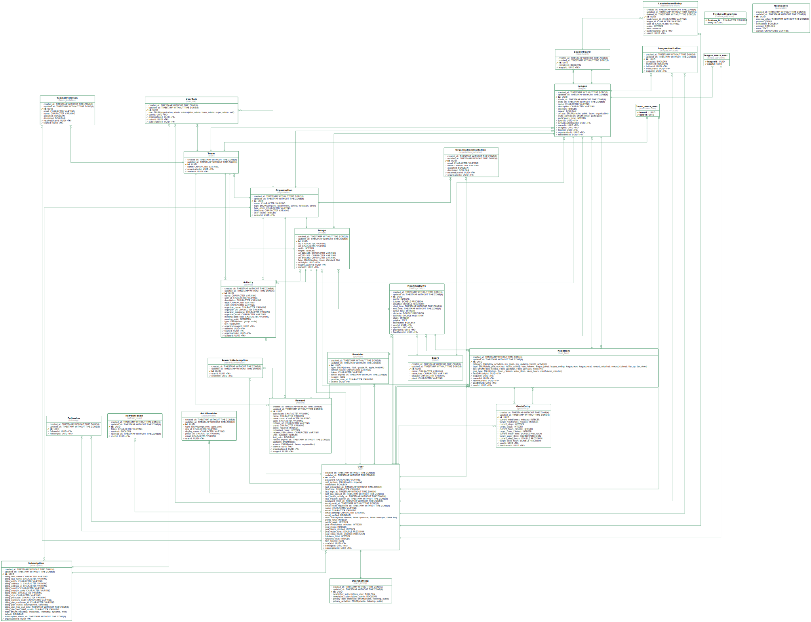

# Fitlink Monorepo

This is the Fitlink monorepo initialized using Nest's monorepo project structure. In future this repo will also contain the React Native app.

## Leaderboard Entries

At this time, only leaderboard entries are available, in order to make querying the leaderboard in real time performant. 

## Get started

### Git hook (prettier)
Make sure to setup the git hooks for the project. The hook is currently used for prettier transformation during commit. Install as follows:

```git config core.hooksPath .githooks```


### Install dependencies

```yarn install```

### Run docker
A docker-compose file is available to run redis + postgres. 

```docker-compose up -d```

### Run the app 

```yarn run start:dev```

The api will be available at http://localhost:3000/api/v1/leaderboard-entries

In order for the app to work correctly, migrations should be run (postgres service must be available from Docker)

```yarn run db:migration:run```

### E2E tests

Run the e2e tests:

```yarn run test:e2e```


### Bearer authentication

Simple bearer authentication is in place.

## Swagger

Swagger documentation is provided at http://localhost:3000/api/v1

## Generate database UML

You can generate a database UML diagram from Typeorm entities using the command

```yarn run db:diagram```


